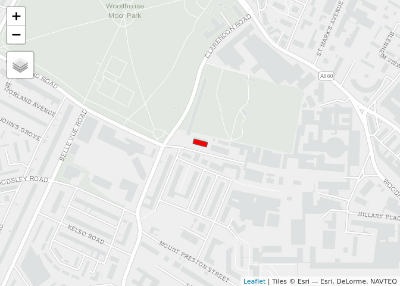
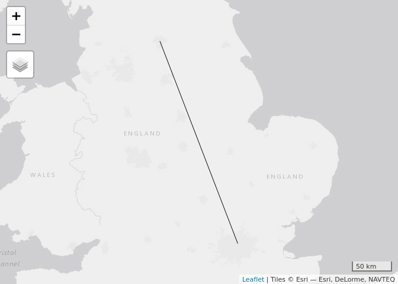

<!-- README.md is generated from README.Rmd. Please edit that file -->

## Aim

The aim of R for Highways Research and Transport Planning is to teach
how R can be used as a powerful tool for processing, visualising and
modelling transport data.

Course contents can be found online at:
<https://github.com/ITSLeeds/highways-course>

## Location

Leeds Institute for Transport Studies, 40 University Road, LS2 9JT. It
can be seen in this [web
map](https://www.openstreetmap.org/way/84749920), highlighted in red
below, just opposite Woodhouse Moore (it’s a 20 minute walk from the
station):

<!-- -->

## Course contents

09:00-09:30 Arrival and set-up

09:30-11:00 Introduction to the course and software

  - Introduction to R
  - R installation questions/debugging
  - How to use RStudio (practical in groups of 2)
  - R classes and working with data frames (CC)

11:15-12:30 Statistics and packages

<!-- And example from the PCT -->

  - Stats refresher: plots and descriptive statistics
  - Predictive models
  - Using packages: examples with the tidyverse

**Lunch**

13:30-15:00 Spatial data in R

  - Spatial data in R
  - R’s spatial ecosystem (see section [1.4 of Geocomputation with R -
    package
    ecosystem](https://geocompr.robinlovelace.net/intro.html#rs-spatial-ecosystem))
  - Practical: [Section 3.2
    to 3.2.2](https://geocompr.robinlovelace.net/attr.html#vector-attribute-manipulation)
    of
    handouts
  - [Exercises](https://geocompr.robinlovelace.net/attr.html#exercises-1):
    1 to 3 in the hand-outs
  - Further reading:
    [Chapter 7](https://geocompr.robinlovelace.net/read-write.html) of
    Geocomputation with R - data import/export and
    [exercises](https://geocompr.robinlovelace.net/read-write.html)
  - Bonus (relies on internet/data): read-in and analyse datasets you
    use at work as data frames or sf objects.

15:15-16:30 Real-work example and consolidation

  - Demo of roadworks data with R
  - Practical: working-through sections [3.2.3
    to 3.2.4](https://geocompr.robinlovelace.net/attr.html#vector-attribute-joining)
    of
    hand-outs
  - [Exercises](https://geocompr.robinlovelace.net/attr.html#exercises-1):
    4 to 6 onwards
  - Advanced option: Section [4.2 - Spatial operations on vector
    data](https://geocompr.robinlovelace.net/spatial-operations.html#spatial-vec)
    of Geocomputation with R
    <!-- - Advanced option: Section [2.2](https://geocompr.robinlovelace.net/spatial-class.html#vector-data) of Geocomputation with R -->

**Day 2 transport data**

09:30-11:00 Stream 1: An introduction to point (Stats19) data

  - Point data: Stats19
  - Spatial and temporal subsetting
  - Aggregation

09:30-11:00 Stream 2: Recap of day

Slow demo of:

  - Set-up
  - Subsetting
  - Dplyr and ggplot2

11:15-12:30 Desire lines and routing

  - Desire lines: using origin-destination data
  - Routing
  - Bonus: finding crash hotspots

**Lunch**

13:30-15:00 Road traffic data

  - Traffic data introduction (Josh Manning and Ivo)
  - Temporal analysis
  - Spatial analysis

15:15-16:30 Practical application

  - Stream 1: Consolidation of exercises
  - Stream 2: Working on real datasets such as flooding or traffic data,
    or improving specific skills such as visualisation

## Prerequisites

### Prior reading/experience

If you are new to R, ensure you have attempted a basic introductory
course such as DataCamp’s [introduction to
R](https://www.datacamp.com/courses/free-introduction-to-r) free course
or equivalent.

If you’re interested in R for ‘data science’ and
installing/updating/choosing R packages, these additional resources are
recommended (these optional resources are all freely availble online):

  - The introductory chapter of [R for Data
    Science](https://r4ds.had.co.nz/introduction.html)
  - Chapter 2 on [setting-up
    R](https://csgillespie.github.io/efficientR/set-up.html) and section
    4.4 on [package
    selection](https://csgillespie.github.io/efficientR/workflow.html#package-selection)
    in the book *Efficient R Programming*
  - The [Transport](https://geocompr.robinlovelace.net/transport.html)
    chapter of the new book Geocomputation with
R

<!-- (MIDAS Gold) -->

<!-- ## Optional extras (to discuss) -->

<!-- - Roadworks data (HTDD/Scottish/Leeds data - HE have data?) -->

<!-- - Stats19 -->

<!-- - Routing engines -->

<!-- - Air pollution -->

<!-- - Traffic data (other) -->

<!-- ## To discuss/confirm -->

<!-- - 10 ppl HE + 8 RAC  -->

<!-- - Managed work laptops - install pre-requisites - pre-reqs document. -->

<!-- - Demonstrators (ask Josh - possible fee, ask Maxine should be fine) -->

<!-- - Ivo Helper -->

<!-- - Location: look into it - plus refreshments -->

<!--   - None HE Leeds -->

<!--   - Maybe HE Birmingham -->

<!--   - Maybe RAC -->

<!-- - Timing: mid November or w/c 10th Dec -->

### Computing requirements

Attendees are expected to bring their own laptop with the following
packages installed and working. You can check these are all installed,
and install those that are not installed, as follows (you can also just
type `install.packages("sf")` etc):

``` r
install.packages("osmdata")   # for working with open street map data
install.packages("sf")        # a package for working with spatial data
install.packages("spData")    # provides example data
install.packages("stplanr")   # a transport data package
install.packages("tidyverse") # metapackage for data science
install.packages("tmap")      # a mapping package

# Make sure your packages are up-to-date with:
update.packages()
```

In addition, it would be useful to have oneminutetraffic, which can be
installed with:

``` r
devtools::install_github("RACFoundation/oneminutetrafficdata")
```

## Reproducible example

The code in the following example checks you have the necessary packages
installed. It results in a map that will guide you to the location of
the course.

Attach the packages:

``` r
library(sf)
library(stplanr)
library(tidyverse)
```

The overall route assuming you’re travelling from London:

``` r
uk = spData::world %>% 
  filter(name_long == "United Kingdom")
origin_lnd = c(-0.1, 51.5)
destination = c(-1.55, 53.8)
odmatrix = matrix(c(origin_lnd, destination), ncol = 2, byrow = TRUE)
line_lnd = st_linestring(odmatrix) %>% 
  st_sfc() %>% 
  st_sf(crs = 4326)
plot(st_geometry(uk), col = "grey")
plot(line_lnd, add = TRUE, lwd = 5, col = "red")
```

<!-- -->

## Shortcut keys:

``` r
# Useful shortkeys --------------------------------------------------------

# Tab-Autocomplete
# Alt-Up/Down: move current line (shift copies it)
# Ctl-Shift-C: Comment line
# Ctl-Shift-R: Add section
# Ctl-Shift-m %>% %>% %>% %>% %>% %>% %>% %>% %>% 
# Ct1-1/2 put cursor in source/console
# Ctl-Alt-T Execute as system command, e.g.:
# cp -Rv * /tmp
# Ctl-Alt-Down: duplicate cursor
# Alt-Shift-K: show autocomplete keys!
```

<!-- Note: you can test all of these things work by running the following command: -->

<!-- ```{r, eval=FALSE} -->

<!-- source("https://raw.githubusercontent.com/ITSLeeds/highways-course/master/README.R") -->

<!-- ``` -->

<!-- Bonus: find the route from Leeds rail station  -->

<!-- (see the code in `README.R` on the course website at https://github.com/ITSLeeds/highways-course ) -->
