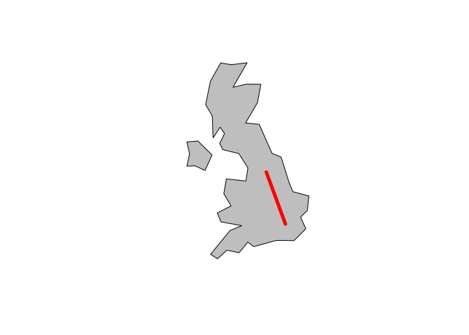

<!-- README.md is generated from README.Rmd. Please edit that file -->

## Aim

The aim of highways-course is to provide content for a 2 day course on R
and transport data with R.

## Course contents (times TBC)

  - Introduction to R
  - How to use RStudio
  - Using packages (emphasis: tidyverse) (ROBIN: agree.  Apologies that oneminutetrafficdata isn't tidy! IW)
  - Stats refresher
  - Temporal data

**Lunch**

  - Spatial data in R

  - Intro + R’s spatial ecosystem: See section 1.4 of Geocomputation
    with R Working with attribute data (10:30 - 11:00) Section 3.2 of
    handouts

  - Spatial data and the tidyverse lecture (11:15 - 11:30)
    
      - Vector data classes
      - Online tutorial: 2.1 of Geocomputation with R (11:30 - 12:00)

**Day 2 transport data**

  - Origin-destination / stats19 (ROBIN: gmapsdistance package?  STATS19 from stplanr, from raw and/or from whatever HE takes in.  IW)

**Lunch**

  - Traffic data (MIDAS Gold)

## Optional extras (to discuss)

  - Roadworks data (HTDD/Scottish/Leeds data - HE have data?) (ROBIN: No more than a demo to whet the appetite, I think. IW)
  - Stats19
  - Routing engines
  - Air pollution
  - Traffic data (other)
  (ROBIN: GGPLOT2!! Heatmaps, scatterplots, worth asking what charts HE likes. Also, how about EA data on flooding?  I have some stuff on this...IW)

## To discuss/confirm

  - 10 ppl HE + 8 RAC
  - Managed work laptops - install pre-requisites - pre-reqs document.
  - Demonstrators (ask Josh - possible fee, ask Maxine should be fine)
  - Ivo Helper
  - Location: look into it - plus refreshments
      - None HE Leeds
      - Maybe HE Birmingham
      - Maybe RAC
  - Timing: mid November or w/c 10th Dec

## Prerequisites

Attendees are expected to bring their own laptop with the following
packages installed and working:

``` r
pkgs = c(
  "osmdata",   # for working with osmdata
  "sf",        # a package for working with spatial data
  "stplanr",   # a transport data package
  "tidyverse", # metapackage for data science
  "tmap"       # a mapping package
)
```

You can check these are all installed, and install those that are not
installed, as follows (you can also just type `install.packages("sf")`
etc):

``` r
pkgs_installed = pkgs %in% installed.packages()
names(pkgs_installed) = pkgs
pkgs_installed
#>   osmdata        sf   stplanr tidyverse      tmap 
#>      TRUE      TRUE      TRUE      TRUE      TRUE
if(!all(pkgs_installed)) {
  install.packages(pkgs[!pkgs_installed])
}
```

In addition, it would be useful to have oneminutetraffic, which can be
installed with:

``` r
devtools::install_github("RACFoundation/oneminutetrafficdata")
#> Using GitHub PAT from envvar GITHUB_PAT
#> Skipping install of 'oneminutetrafficdata' from a github remote, the SHA1 (e4c6e70d) has not changed since last install.
#>   Use `force = TRUE` to force installation
```

## Reproducible example

The code in the following example checks you have the necessary packages
installed. It results in a map that will guide you to the location of
the course.

Attach the packages:

``` r
library(sf)
#> Linking to GEOS 3.6.2, GDAL 2.2.3, proj.4 4.9.3
library(stplanr)
library(tidyverse)
#> ── Attaching packages ────────────────────────────────────────────────────── tidyverse 1.2.1 ──
#> ✔ ggplot2 3.0.0     ✔ purrr   0.2.5
#> ✔ tibble  1.4.2     ✔ dplyr   0.7.6
#> ✔ tidyr   0.8.1     ✔ stringr 1.3.1
#> ✔ readr   1.1.1     ✔ forcats 0.3.0
#> ── Conflicts ───────────────────────────────────────────────────────── tidyverse_conflicts() ──
#> ✖ dplyr::filter() masks stats::filter()
#> ✖ dplyr::lag()    masks stats::lag()
```

The overall route assuming you’re travelling from London:

``` r
origin_lnd = geo_code("London Kings Cross")
destination = geo_code("Worsley Building, Leeds")
odmatrix = matrix(c(origin_lnd, destination), ncol = 2, byrow = TRUE)
line_lnd = st_linestring(odmatrix) %>% 
  st_sfc() %>% 
  st_sf(crs = 4326)
m1 = tmap::qtm(line_lnd)
tmap::tmap_leaflet(m1)
```

<!-- -->

The route from Leeds rail station looks like this:

``` r
origin_lds = geo_code("Leeds rail station")
destination = geo_code("Worsley Building, Leeds")
bb = matrix(c(-1.56, 53.7, -1.53, 53.9), ncol = 2)
library(osmdata)
#> Data (c) OpenStreetMap contributors, ODbL 1.0. http://www.openstreetmap.org/copyright
roads = opq(bbox = bb) %>% 
  add_osm_feature(key = "highway", value = "pri|sec|res", value_exact = FALSE) %>% 
  osmdata_sf()
sln = SpatialLinesNetwork(roads$osm_lines)

from_sln = find_network_nodes(sln, origin_lds[1], origin_lds[2])
to_sln = find_network_nodes(sln, destination[1], destination[2])

r_local = sum_network_routes(sln, from_sln, to_sln, "length", combinations = F)

m2 = tmap::qtm(r_local)
library(leaflet)
tmap::tmap_leaflet(m2) %>% 
  addCircleMarkers(lng = origin_lds[1], lat = origin_lds[2]) %>% 
  addCircleMarkers(lng = destination[1], lat = destination[2])
```

<!-- -->
