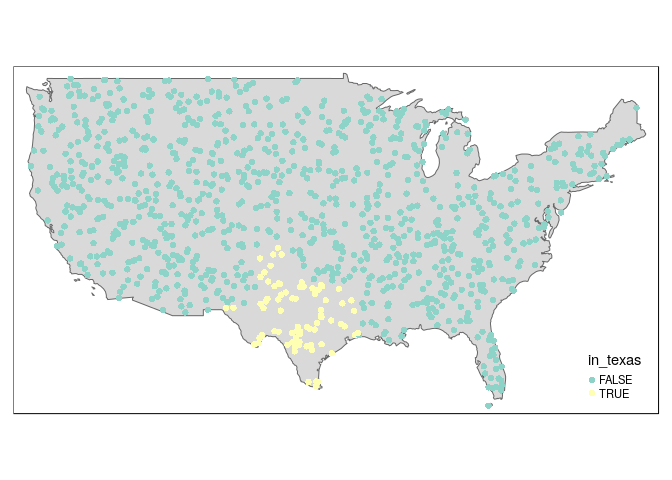

<!-- Note: edit the .Rmd file not the .md file -->

## 1.1 R and RStudio

### 1.1a

1.  Get into groups of 2 and, in those groups:
2.  Create a new RStudio project
3.  Create a new blank R script
4.  Identify and interact with each of the 4 panels in RStudio
5.  Get help on the plot function with `?plot`
6.  Create a plot using the `plot()` function
7.  Find and install a new package on a topic of your choice with `Tools
    > Install Packages` (requires internet)
8.  Attach the package using `library()`
9.  Find and install a new package with `install.packages()`
10. In your source panel write code that creates vector objects `x` and
    `y` and plots them with `plot(x, y)` to create something that looks
    like this:
<!-- (is it reproducible?) -->

<!-- end list -->

``` r
# hint: create a vector object of the numbers 1, 2, 3 and 6 and call it x:
x = c(1, 2, 3, 6)
```

<!-- -->

  - Bonus: find out exactly what R version you are using (tip: use a
    search engine\!)

  - Bonus: use R to find out how many minutes you’ve been alive for.
    Feel free to use an invented age. Tip: try using both ‘base’
    `as.POSIXct()` and ‘tidyverse’ `ymd_hm()` functions - you may also
    need to search online for this.

### 1.1b R classes

1.  What class is each of these objects:
    
    ``` r
    x = 1:6
    y = sqrt(x)
    z = y + 0.1
    z[3] = "hello"
    ```

2.  Create a data frame that contains variables `x`, `y` and `z` and
    write it out as a `.csv` file.
    
      - Bonus create a matrix composed of `x`, `y` and `z` variables.
        What type does it have?

3.  Download and read-in the `ac_wy.csv` dataset using `read_csv()`.
    Hint, the following command may help get
    it:
    
    ``` r
    f = "https://github.com/ITSLeeds/highways-course/releases/download/0.2/ac_wy.csv"
    download.file(url = f, destfile = "ac_wy.csv")
    ```

4.  How many rows are in the `ac_wy` data frame?

5.  How many lists are in the `ac_wy` data frame?

## 2 Stats refresher and packages

1.  Discuss in groups: what kind of statistical analysis do you you do,
    exploratory or hypothesis testing?

2.  Use `sessionInfo()` to find out what which packages are currently
    attached in your R session.
    
      - How many are there?
      - Run the command `devtools::session_info()`. What’s different
        about the result?

3.  Attach the tidyverse package. What does each of the messages
        mean?:
    
        ## ── Attaching packages ───────────────────────────────────────────────────────────────────────────────────── tidyverse 1.2.1 ──
    
        ## ✔ ggplot2 3.1.0     ✔ purrr   0.2.5
        ## ✔ tibble  1.4.2     ✔ dplyr   0.7.8
        ## ✔ tidyr   0.8.2     ✔ stringr 1.3.1
        ## ✔ readr   1.1.1     ✔ forcats 0.3.0
    
        ## ── Conflicts ──────────────────────────────────────────────────────────────────────────────────────── tidyverse_conflicts() ──
        ## ✖ dplyr::filter() masks stats::filter()
        ## ✖ dplyr::lag()    masks stats::lag()

4.  How many packages are now attached?

5.  Restart your R session and load some **tidyverse** packages
    individually. Start with **readr**, **dplyr** and **ggplot2**.

6.  Run `ggplot(data = mpg)`. What do you see?

7.  What does the `drv` variable describe? Read the help for `?mpg` to
    find out.

8.  Make a scatterplot of `hwy` vs `cyl`.

9.  Create a barplot showing the number and proportion of crashes in the
    `ac_wy` dataset on different types of roads using **ggplot2**:

<!-- end list -->

  - Roads with different speed limits (absolute counts and proportions)
  - Different road types (A roads, B roads etc)
    <!-- -->

# 3 Spatial data

1.  Practical: [Section 3.2
    to 3.2.2](https://geocompr.robinlovelace.net/attr.html#vector-attribute-manipulation)
    of handouts

2.  Work through exercises 1:3 in the hand-outs

3.  How many states:
    
      - Contain the letter E (hint: `?grepl`)?
      - Start with A (hint: search for “regex starts with”)?

4.  Plot all the ‘E’ states in red and plot the ‘A’ states with a thick
    border.
    <!-- -->

<!-- end list -->

  - Bonus: use the `world` dataset to find the top 3 smallest and
    largest countries in the world by population and area, and plot them
    on a single map.

## 4 Spatial data II and roadworks

1.  Practical: working-through sections [3.2.3
    to 3.2.4](https://geocompr.robinlovelace.net/attr.html#vector-attribute-joining)
    of
    hand-outs
2.  [Exercises](https://geocompr.robinlovelace.net/attr.html#exercises-1):
    4 to 6 onwards
3.  Identify the states that grew most and least from 2010 to 2015 and
    plot them.
    <!-- -->
4.  Create an obect that represents the boundary of the USA.

<!-- end list -->

  - Bonus: create a random distribution of 1000 points across the United
    States and subset those that are in Texas. Plot the results to check
    your code works, does it look something like this?
    <!-- -->
  - Advanced option 1: Section [4.2 - Spatial operations on vector
    data](https://geocompr.robinlovelace.net/spatial-operations.html#spatial-vec)
    of Geocomputation with R
  - Advanced option 2: Install the **roadworksUK** package and identify
    which MSOA in Ashford had the highest number of gas-related
    roadworks in the `htdd_ashford` dataset.
