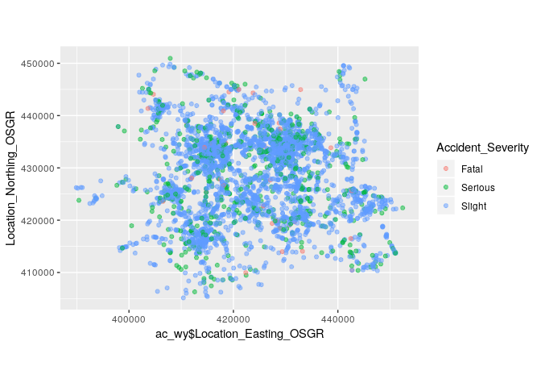
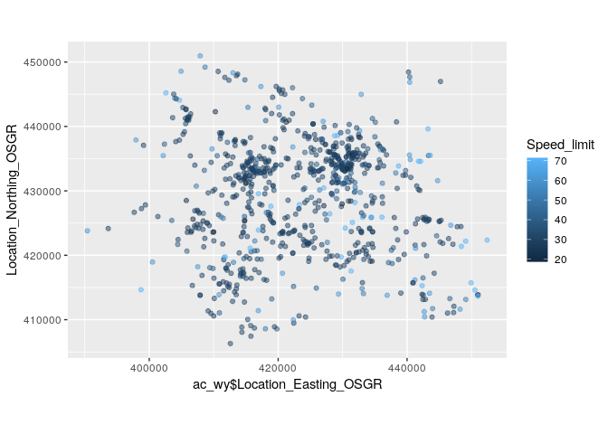
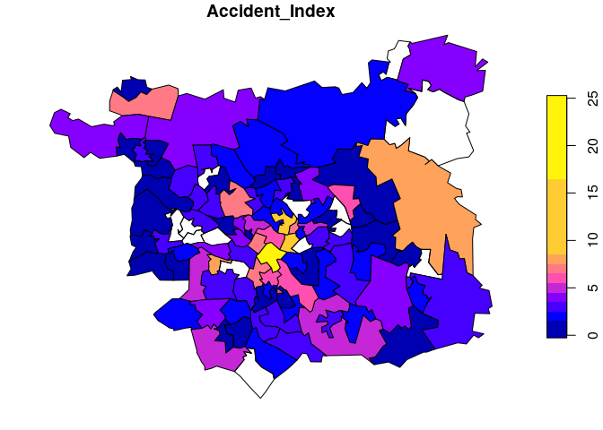

<!-- Note: edit the .Rmd file not the .md file -->

# Exercises day 2

## 1 Recap and point data

1.  Start off by attaching the **tidyverse** with the `library()`
    function.

2.  Create (or recreate) an object called `ac_wy` with the command
    `read_csv()` (you may need to first download the file from
    <https://github.com/ITSLeeds/highways-course/releases> )

3.  What is the class of the `ac_wy`?

4.  Create a plot of dataset using **ggplot2**, resulting in a plot that
    looks a little like this (hint: set transparency with `alpha` in
    `geom_point()`, fix the coordinates with `+ coord_equal()`):
    <!-- -->

5.  Building on the previous plot, make the size of each dot
    proportional to the number of people involved
    (`Number_of_Casualties`).

6.  Filter the dataset so that it contains only rows with
    `Accident_Severity` values of `Killed` or `Serious` (hint: `!=
    "Slight"` may help\!).

7.  Further reduce the dataset size by selecting only the following
    columns for further analysis: `Accident_Index,
    Location_Easting_OSGR, Location_Northing_OSGR, Accident_Severity,
    Date, Speed_limit`.

8.  Create a new plot showing the distribution of speed limits.
    <!-- -->

9.  Load the **sf** library.

10. reate an object called `ac_wy_sf`, a spatial version of the `ac_wy`
    dataset read-in previously (hint: use the function `st_as_sf()` and
    coordinate variables
    Location\_Easting\_OSGR/Location\_Northing\_OSGR — set the CRS with
    `crs = 27700`)

11. Plot the result with **tmap**, showing accident severity (hint: the
    code below plots the result for the speed limit).
    
    ``` r
    library(tmap)
    tm_shape(ac_wy_sf) +
        tm_dots("Speed_limit")
    ```

12. Set the mode of **tmap** to viewing with `tmap_mode("view")` and run
    the previous command again to create an interactive map.

13. Use this to visually identify a junction with many crashes.

14. Read-in a dataset representing Leeds with the following command
    (note: you need to have downloaded the file from
    <https://github.com/ITSLeeds/highways-course/releases> ):
    
    ``` r
    leeds = readRDS("leeds.Rds")
    ```

15. Find the CRS of `leeds` with `st_crs()`

16. Transform the CRS to OSGB with the command `st_transform()` (hint:
    OSGB has the EPSG code 27700).

17. Find out how many fatal and serious crashes happened in each of the
    MSOA areas in Leeds
    <!-- -->

## Advanced

  - Advanced 1: Find out which MSOA zone had the highest average number
    of people in crashes
  - Advanced 2: Look-up packages for clustering (hint: look at
    <https://geocompr.github.io/geocompkg/articles/> )
  - Advanced 3 (difficult): Aggregate point to regular grid cells
