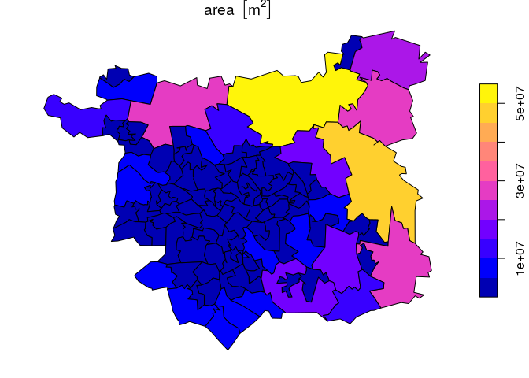
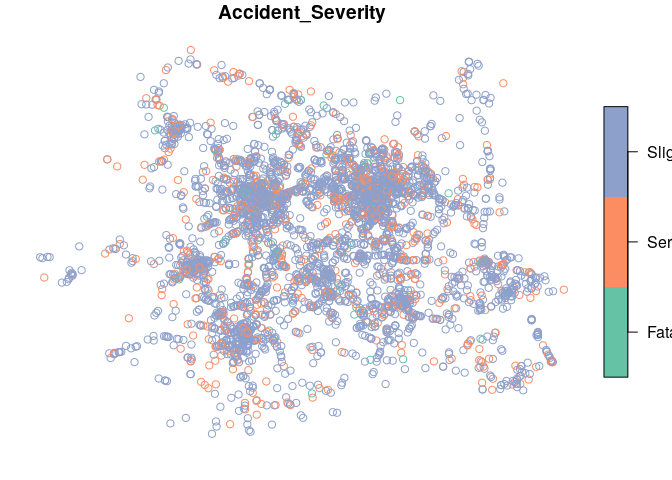

<!-- Note: edit the .Rmd file not the .md file -->

## 5 Point data

1.  Starting where we left-off, complete exercises 7 and 12 from the
    hand-outs

2.  Read-in the dataset `leeds.Rds`

3.  Create a new column in the dataset called `area` that reports the
    area of each MSOA, and plot the result (hint: use `st_area()`)
    
    ``` r
    library(sf)
    ```
    
        ## Linking to GEOS 3.6.2, GDAL 2.2.3, PROJ 4.9.3
    
    ``` r
    leeds = readRDS("data/leeds.Rds")
    leeds$area = st_area(leeds)
    plot(leeds["area"])
    ```
    
    <!-- -->

4.  Create an object called `ac_wy_sf`, a spatial version of the `ac_wy`
    dataset read-in previously (hint: use the function `st_as_sf()` and
    coordinate variables
    Location\_Easting\_OSGR/Location\_Northing\_OSGR — don’t forget to
    set the CRS to 27700)

5.  Plot the result, showing only the accident severity.
    <!-- -->

6.  Create a new object called `ac_wy_wgs` that tranforms the `ac_wy_sf`
    into a geographic (lat/lon) CRS (hint: use `st_crs()` and the EPSG
    code 4326)

7.  Find out how many fatal crashes happened in each of the MSOA areas
    in Leeds
