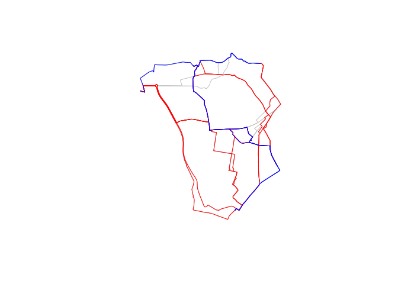
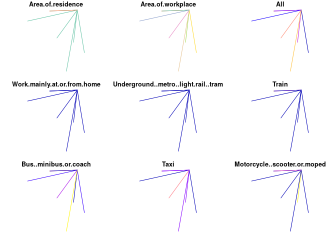

<!-- Note: edit the .Rmd file not the .md file -->

# Exercises day 2 - Transport

  - Load the **stplanr** library
  - How many datasets does it contain (hint use the command
    `data(package = ...)`? Take a look at the help for a few of them.
  - Type in `stplanr::` in your console and hit TAB. What do you see? By
    scrolling down find functions beginning with `geo_*`
  - Find the vignettes in the **stplanr** library and open the vignette
    called `introducing-stplanr`.
  - Using the function `st_length()` find the length of each route in
    `routes_fast_sf` and save the result in an object called
    `routes_fast_sf$lengths`
  - Find the `summary()` of the `rf_lengths`
  - How many lines have length = 0?
  - Create an object called `rf` that only contains routes with non-zero
    distances
  - Identify the top 3 longest and top 3 shortest routes and plot them
    over the routes fast. The result should look like something like
    this:

<!-- -->

  - Create a single desire line for the 2nd to 9th flow using
    **stplanr** code:

  - Convert the result to `sf` class with `st_as_sf()` (**stplanr**
    solution for the 12th line below - the result should look something
    like that
    below):

<!-- end list -->

    ## Warning: plotting the first 9 out of 15 attributes; use max.plot = 15 to
    ## plot all

<!-- -->

  - **Advanced**: Create a single desire line for the 12th flow
    **without** using **stplanr** code:

  - Visualise the `flowlines` object using **tmap** with different
    colours and widths

  - Create a ‘oneway’ version of the `flowlines` and visualise these
    (tricky)

  - Create a **sf** version of the `flowlines` object (advanced)

  - Work through the
    [vignette](https://cran.r-project.org/web/packages/stplanr/vignettes/introducing-stplanr.html)
    provided by:

  - For another day (or if you’re very fast\!): read-over
    <https://geocompr.robinlovelace.net/transport.html> and complete the
    exercises at the end
