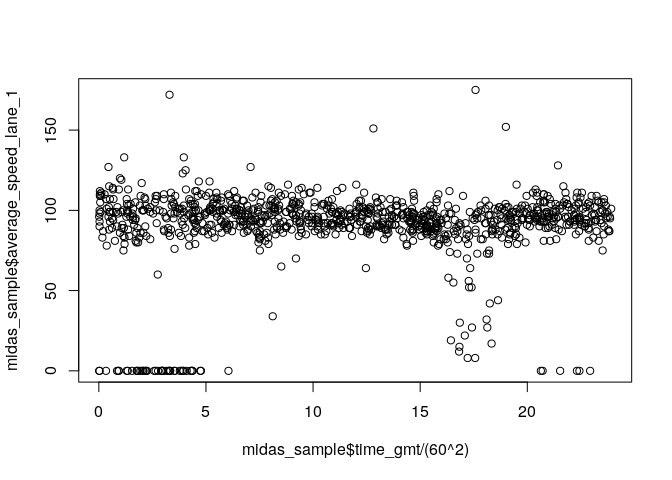
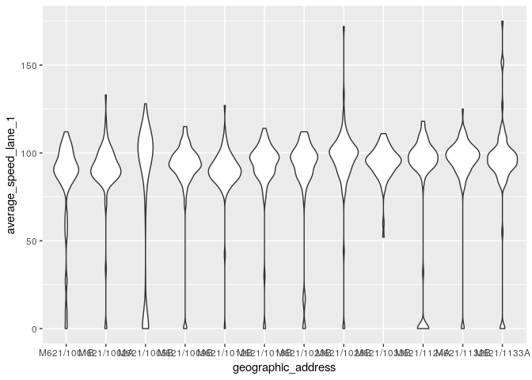
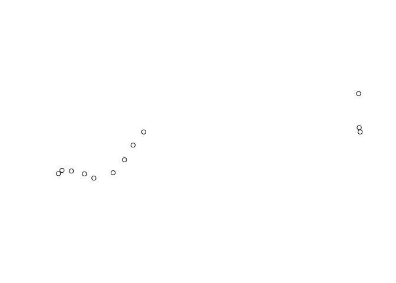
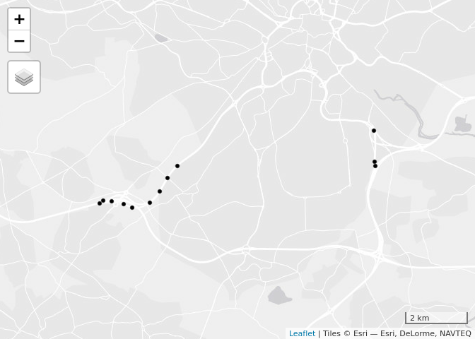
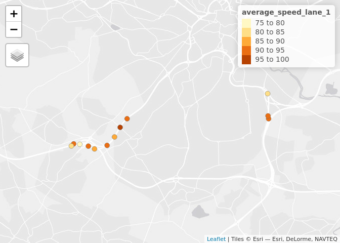

MIDAS data was downloaded with the
[oneminutetrafficdata](https://github.com/RACFoundation/oneminutetrafficdata)
package. Code to access the data can be found at
[github.com/jmanning1/Traffic\_Code](https://github.com/jmanning1/Traffic_Code)
(script file
[004](https://github.com/jmanning1/Traffic_Code/blob/master/Code/004_Download_MIDAS_Gold_Traffic_Data_2016.R)
downloads the data, `R.utils::bunzip2()` can unzip them). A sample of
open MIDAS data (and many other datasets can be found
[here](https://odileeds.org/blog/2016-10-07-highwayshack-datasets).

We will use the **tidyverse** package to analyse the data and **sf** to
do geographic analysis:

``` r
library(sf)
library(tmap)
library(tidyverse)
```

Some cleaning was done (clean names were created with the **snakecase**
package) but the fundamentals of the following code should work with
many MIDAS-derived datasets:

``` r
library(tidyverse)
midas_all = read_csv("2017-12-01--2017-12-07.csv")
```

This is not a particularly large dataset by today’s dataset. Even so, it
makes sense to take a small sample of it for testing purposes. We can do
this, and save the result, as follows:

``` r
set.seed(1000)
midas_sample = midas_all %>% 
  sample_n(1000)
write_csv(midas_sample, "midas_sample.csv")
```

We will work with this smaller dataset before moving on to analyse
patterns in the larger dataset. All of the commands executed here on
`midas_sample` will work equally well on `midas_all`, just lots faster:

``` r
midas_sample = read_csv("midas_sample.csv")
names(midas_sample)
```

    ##  [1] "control_office"                  "geographic_address"             
    ##  [3] "year"                            "month"                          
    ##  [5] "day"                             "day_of_week"                    
    ##  [7] "type_of_day"                     "days_after_nearest_bank_holiday"
    ##  [9] "time_gmt"                        "number_of_lanes"                
    ## [11] "flow_category_1"                 "flow_category_2"                
    ## [13] "flow_category_3"                 "flow_category_4"                
    ## [15] "average_speed_lane_1"            "total_flow_lane_1"              
    ## [17] "occupancy_lane_1"                "average_headway_lane_1"         
    ## [19] "average_speed_lane_2"            "total_flow_lane_2"              
    ## [21] "occupancy_lane_2"                "average_headway_lane_2"         
    ## [23] "average_speed_lane_3"            "total_flow_lane_3"              
    ## [25] "occupancy_lane_3"                "average_headway_lane_3"

This shows we have 26 variables, all of which have relatively clear
names. We can do summary statistics on these. What’s the average speed
in each lane of traffic, for example?:

``` r
mean(midas_sample$average_speed_lane_1)
```

    ## [1] 90

What is the distribution of speeds over time?

``` r
plot(midas_sample$time_gmt / (60^2), midas_sample$average_speed_lane_1)
```

<!-- -->

We can investigate the distribution of speeds visually by plotting the
data:

``` r
ggplot(midas_sample) +
  geom_violin(aes(x = geographic_address, y = average_speed_lane_1))
```

<!-- -->

## Joining with geographic data

The data is clearly temporal but it also has a spatial element,
identified by the geographic address
    column:

``` r
unique(midas_sample$geographic_address)
```

    ##  [1] "M621/1132B" "M621/1009B" "M621/1023B" "M621/1012B" "M621/1028B"
    ##  [6] "M621/1133A" "M621/1005B" "M621/1002A" "M621/1018B" "M621/1001B"
    ## [11] "M621/1033B" "M621/1124A"

We need a separate geographic object to ‘geolocate’ these sites. This is
provided in the `midas_sites.geojson` file, which can be imported as
follows:

``` r
midas_sites = read_sf("data/midas_sites.geojson")
st_crs(midas_sites)
```

    ## Coordinate Reference System:
    ##   EPSG: 4326 
    ##   proj4string: "+proj=longlat +datum=WGS84 +no_defs"

These can then be plotted, e.g. with:

``` r
plot(midas_sites$geometry)
```

<!-- -->

To add context we need a basemap. That can be added as follows:

``` r
tmap_mode("view")
```

    ## tmap mode set to interactive viewing

``` r
qtm(midas_sites)
```

<!-- -->

## Site summaries

``` r
midas_means = midas_sample %>% 
  group_by(geographic_address) %>% 
  summarise_if(is.numeric, mean)
```

We can plot these average speeds as follows, after joining the results
with the geographic data:

``` r
midas_joined = left_join(midas_sites, midas_means)
```

    ## Joining, by = "geographic_address"

``` r
tm_shape(midas_joined) +
  tm_bubbles(col = "average_speed_lane_1", size = 5)
```

<!-- -->
