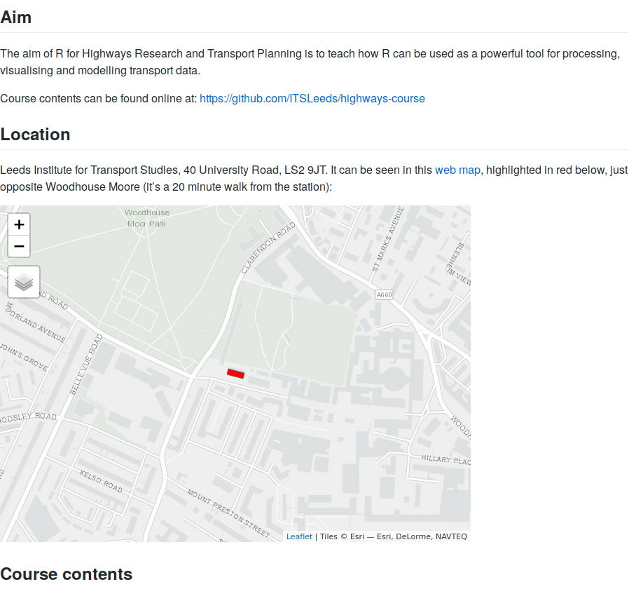

```{r, echo=FALSE, eval=FALSE}
file.copy("slides/intro.html", ".", T)
piggyback::pb_upload("intro.html")
```

<!-- Plan: 15 minute presentation building on pct work and mlCars stuff -->

## Outline

- Introductions 
- An introduction to R
- An introduction to RStudio

## Introductions + housekeeping

<div style="float: left; width: 60%;">

<!-- - Welcome to the University of Leeds -->

```{r, echo=FALSE, out.width="100%"}

```

</div>

<div style="float: right; width: 40%;">

- We are:

> - Robin Lovelace
> - Colin Caine
> - Nikée Groot
> - Josh Manning
> - Malcolm Morgan

- Course home: [github.com/ITSLeeds](https://github.com/ITSLeeds/highways-course)
- Getting help
- Handouts

</div>

## What is R?

From the horse's mounth [@rcoreteam_language_2018], "R is an integrated suite of software facilities for data manipulation, calculation and graphical display. Among other things it has

> - an effective data handling and storage facility,
> - a suite of operators for calculations on arrays, in particular matrices,
> - a large, coherent, integrated collection of intermediate tools for data analysis,
> - graphical facilities for data analysis and display either directly at the computer or on hardcopy, and
> - a well developed, simple and effective programming language [with] conditionals, loops, user defined recursive functions and input and output"

```{r, eval=FALSE}
help.start() # get started with R, from in R!
```

## Y R?

Start with broader questions:

- Why use a programming language at all?

> - Because it allows you to do more things than monolithic programs driven by a graphical user interface (GUI) such as Microsoft Excel and ESRI's ArcMap.

- Why use a command-line interface (CLI)?

> - It lets you get things done faster (once you learn the workflow)
> - Scalability, e.g. the Propensity to Cycle Tool ([PCT](http://www.pct.bike/)) [@lovelace_propensity_2017]
> - Reproducibility

## Which language?

<div style="float: left; width: 40%;">

> - One that has a large user community
> - That has powerful spatial, temporal and modelling capabilities
> - That excels at visualisation and statistical analysis

</div>

<div style="float: right; width: 60%;">
```{r, echo=FALSE, out.width="100%"}
knitr::include_graphics("https://stackoverflow.blog/wp-content/uploads/2017/10/tag_growth_scatter-1-771x675.png")
```
</div>

## An introduction to R's syntax

Everything that 'exists' is an object

```{r}
x = 1
y = matrix(1:9, nrow = 3)
z = data.frame(y)
```

Everything that happens is a function

```{r}
exp(x)
sqrt(z)
```

<!-- This overflows the page. Doesn't matter much -->

## An introduction to RStudio

<p><a href="https://www.rstudio.com/products/RStudio/?wvideo=520zbd3tij"></a></p><p><a href="https://www.rstudio.com/products/RStudio/?wvideo=520zbd3tij">RStudio IDE Overview</a></p>

- Source: [rstudio.com](https://www.rstudio.com/products/RStudio/?wvideo=520zbd3tij)

## Now over to you

- Get into groups of 2 or 3
- Work through exercises 1.1a
- Ask questions, generate errors, have fun!

## Links + references

- CRAN: https://cran.r-project.org/
